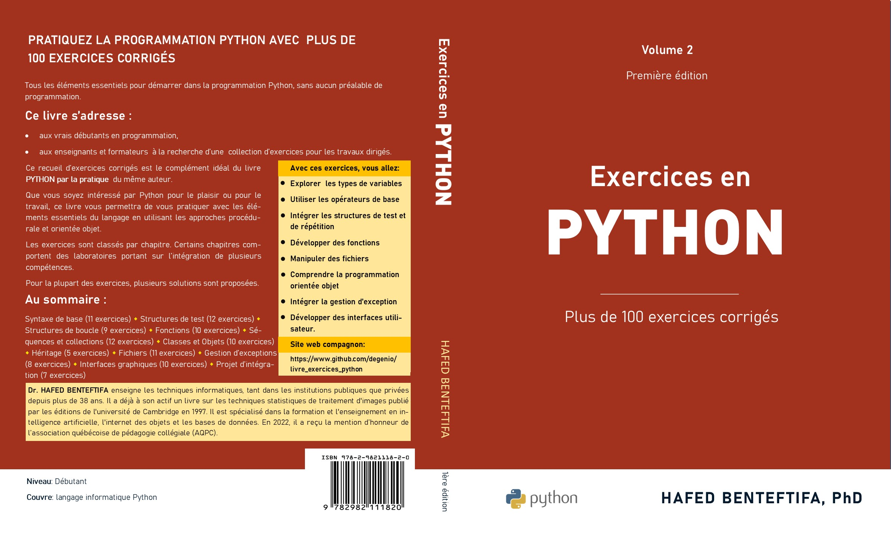

# Solutionnaires du livre Python par la pratique

## Description

Ce référentiel contient le code source et les exemples de programmation pour le livre "Exercices en Python". 

Il est destiné aux vrais débutants en programmation et aux enseignants et formateurs  à la recherche d’une  collection d’exercices pour les travaux dirigés.

## Contenu du livre

1 Syntaxe de base  
2 Structures de test  
3 Structures de boucle  
4 Fonctions  
5 Séquences et Collections  
6 Classes et Objets  
7 Héritage  
8 Fichiers  
9 Gestion d’exceptions  
10 Interfaces graphiques  
11 Projet d'intégration 

## Préalable

Une connaissance préalable en programmation en Python est requise pour tirer parti de ce livre. Des instructions d'installation  détaillées de l'environnement pycharm sont fournies dans le premier chapitre du livre.

## Auteur

Exercices en Python a été écrit par Hafed Benteftifa. Vous pouvez me contacter à info@degenio.com pour toute question ou commentaire.

